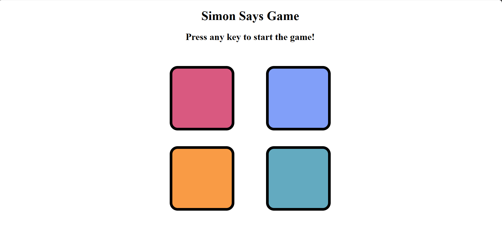

Simon Says — Memory Game

A browser-based memory game built with vanilla JavaScript where each round extends a randomly generated color sequence that the player must reproduce correctly.

## 🚀 Live Demo

[**Play the Live Game →**](https://simon-says-game-xmtw.onrender.com/))

## How It Works

The game maintains two sequences: one generated by the game and one built from the player's input.

- Each level adds one randomly selected color to the existing sequence.
- The sequence is revealed through timed button-flash feedback.
- Each player click is captured and compared against the corresponding position in the generated sequence.
- A complete match advances the player to the next level and extends the pattern by one step.
- A mismatch ends the current run, provides visual feedback, and resets the game state.

## Core Logic

`gameSeq` builds the pattern while `userSeq` records the player's response.

Each round extends the pattern by one random color. Player input is compared against the generated sequence at each position, advancing the level only when the complete sequence is matched.

## Tech Stack

HTML5 · CSS3 · Vanilla JavaScript

## Features

- Progressive sequence difficulty
- Randomized color generation
- Position-based input validation
- Level tracking
- Visual feedback
- Automatic game reset

## Preview

